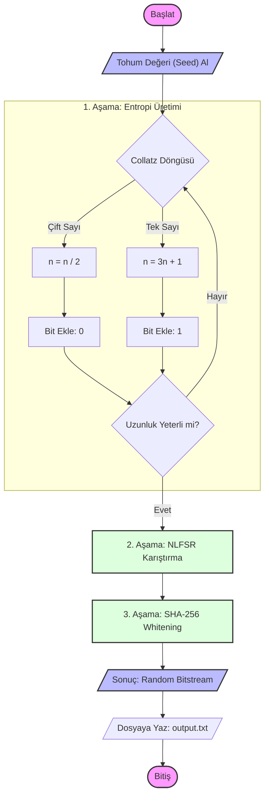

# Collatz Tabanlı Pseudo-Random Number Generator (PRNG)

Bu proje, ünlü **Collatz Sanısı (3n+1 problemi)** dizilerini temel alarak kriptografik açıdan güçlendirilmiş bir **Sözde Rassal Sayı Üreteci (PRNG)** sunar.

Sıradan PRNG'lerin aksine, bu algoritma kaotik bir matematiksel yapıdan (Collatz dizileri) entropi toplar ve bu entropiyi **Nonlinear Feedback Shift Register (NLFSR)** ve **SHA-256 Hash Whitening** teknikleriyle işleyerek yüksek kalitede rassallık elde eder.

---

## Proje Özeti

Algoritma, rassal sayı üretimini üç temel aşamada gerçekleştirir:

1.  **Collatz Entropi Üretimi:** Başlangıç tohum (seed) değeri, Collatz dizisi kurallarına göre (`Çift ise n/2`, `Tek ise 3n+1`) işlenir. Bu süreçten elde edilen sayıların paritesi (tek/çift olma durumu) ham bit akışını oluşturur.
2.  **NLFSR Karıştırma (Mixing):** Elde edilen ham bitler, doğrusal olmayan bir geri beslemeli kaydırma yazmacından geçirilerek (NLFSR) istatistiksel bağımlılıklar kırılır.
3.  **Hash Tabanlı Beyazlatma (Whitening):** Son aşamada, üretilen veri blokları bir sayaç (counter) ile birleştirilip SHA-256 özet fonksiyonundan geçirilir. Bu işlem, bit dağılımını (0 ve 1 dengesi) mükemmel seviyeye getirir.

---

## Akış Şeması (Flowchart)

Algoritmanın çalışma mantığı aşağıdaki şemada detaylandırılmıştır:



---

## Kurulum ve Kullanım

Proje **Python 3** ile geliştirilmiştir. Çalıştırmak için aşağıdaki adımları izleyin:

### 1. PRNG'yi Çalıştırın
Rassal sayıları üretmek ve `output.txt` dosyasına kaydetmek için:

```bash
python collatz_rng.py
```

Bu işlem konsolda üretilen bitlerin istatistiklerini (0/1 oranı vb.) gösterecektir.

### 2. Bitleri Byte'a Dönüştürün (Opsiyonel)
Üretilen `0101...` şeklindeki metin dosyasını, analiz araçlarında kullanılabilecek binary (`.bin`) formatına çevirmek için:

```bash
python bits_to_bytes.py
```
Bu komut `output.bin` dosyasını oluşturur.

---

## Test Sonuçları (Statistical Analysis)

Üretilen veri, endüstri standardı **ENT (Pseudorandom Number Sequence Test Program)** ile test edilmiştir. Sonuçlar, çıktının yüksek entropiye sahip olduğunu göstermektedir.

| Test Metriği | Sonuç Değeri | Açıklama |
| :--- | :--- | :--- |
| **Entropy** | `7.980978` bits/byte | Mükemmel değer 8.0'dır. Çok yüksek rassallık. |
| **Chi-Square** | `213.31` (%97.30) | Verinin rastgele dağıldığını doğrular. |
| **Arithmetic Mean** | `127.63` | İdeal değer 127.5'tir. (0-255 arası ortalama). |
| **Monte Carlo Pi** | `3.1209...` | Pi sayısına (3.1415...) yakınsama başarısı. |
| **Serial Correlation** | `-0.027` | Bitler arası ilişki (korelasyon) yok denecek kadar az. |

---

##  Dosya Yapısı

*   `collatz_rng.py`: Ana PRNG algoritması (Entropy Generation + NLFSR + Whitening).
*   `bits_to_bytes.py`: Yardımcı araç. Bit dizisini binary dosyaya çevirir.
*   `README.md`: Proje dökümantasyonu.